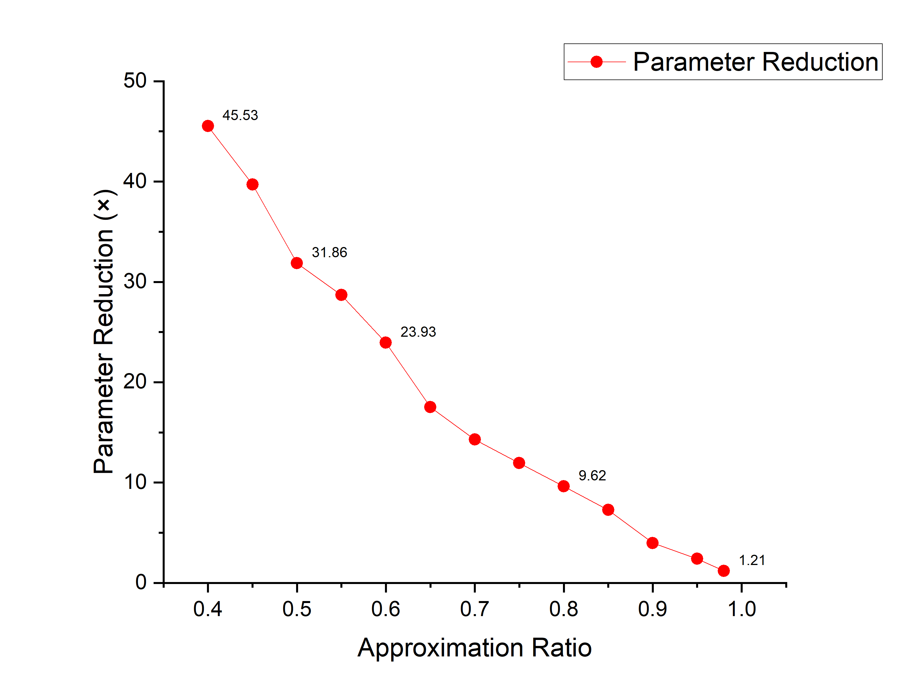
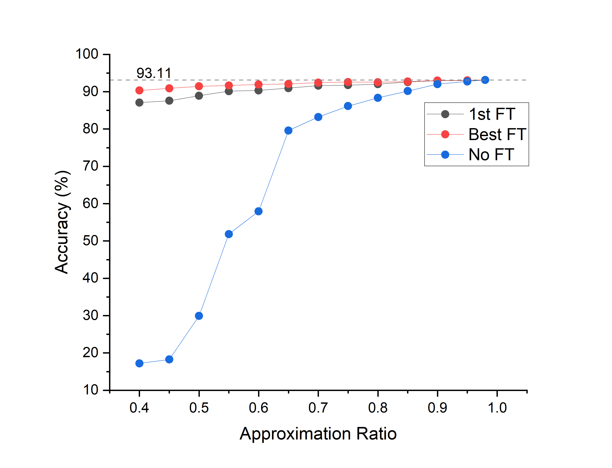
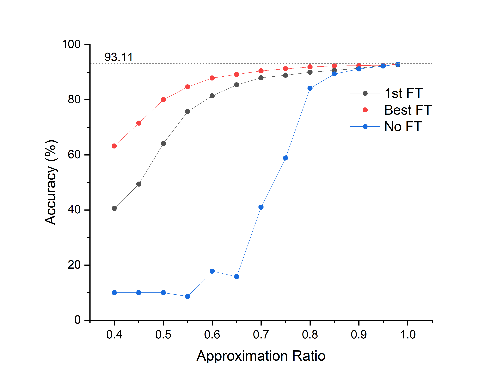
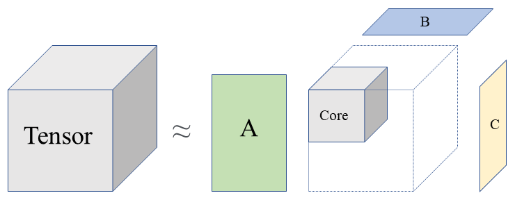
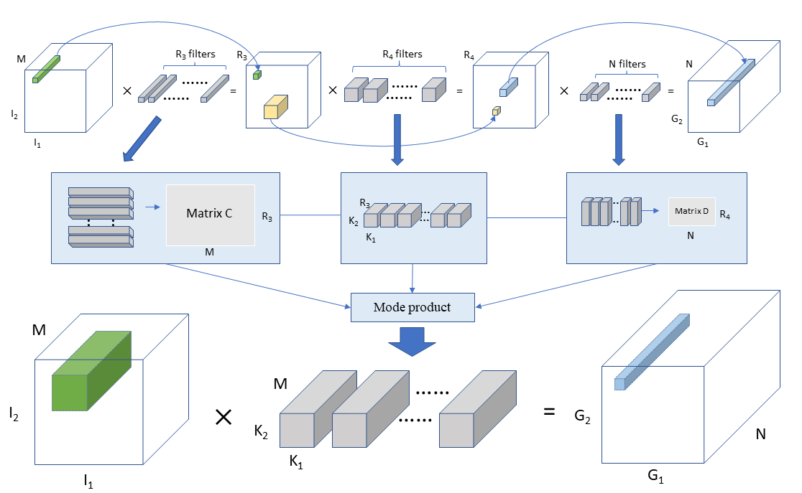

# Compress CNN With Tensor Decomposition

<a target="_blank" href="https://colab.research.google.com/github/K0EKJE/CNN_compression_with_Tensor_Decomposition/blob/main/CNN_compression_demo.ipynb">
  
</a>

## Table of Contents

- [Introduction](#introduction)
- [Takeaways](#Takeaways)
- [Implementation](#Prerequisites)
- [Results](#Result)
- [Math Theory](#Take-a-Brief-Look-at-the-Math-Theories)
  - [Tucker Decomposition](##Tucker-Decomposition)
  - [Compression](##Compression)
  - [Rank Selection](##Rank-Selection)
- [References](#References)

## Introduction

Applications of machine learning problems involving Deep Convolutional Neural Networks (DCNN) face challenges pertained to memory requirements and inference time, which hinder the deployment of networks in resource-constrained environments like mobile devices or embedded systems. To overcome these challenges, I propose to apply the methodology of tensor decomposition to a DCNN in this research project. Mainly, I proposed a new rank selection method based on singular value thresholding for partial Tucker decomposition of the convolutional kernels, which are modeled in our work as 4th-order tensors. Doing so provides a flexible way to address the trade-off between the model complexity and the predictions’ accuracy for an image classification task, for instance. I introduced a new hyper-parameter as an approximation ratio between the tensor norms of the original kernel and the reconstructed tensor after decomposition. The results demonstrate an excellent correlation between the hyperparameter and the accuracy of the network. Also, after decomposition, I fine-tuned the whole network toward standard backpropagation methods, and the decomposed model shows a large accuracy boost. 

The implementation is mainly completed with [PyTorch](http://pytorch.org/) and [Tensorly](http://tensorly.org/). Intuitively, the proposed method substitutes each convolutional layer with three smaller layers with partial Tucker Decomposition, or CP decomposition. Singular value thresholding is utilized to select ranks for the partial Tucker Decomposition, where ranks control the trade-off between compression rate and model accuracy.


## Takeaways
- The decomposition can almost perfectly recover the ability of the original model with proper CP decomposition rank, but it requires far more run time memory and time than Tucker Decomposition
- Introduction of the approximation ratio as a new hyper-parameter, which is found to be closely connected to the accuracy of the model;
- Proposal of a new scalable rank selection scheme for partial Tucker decomposition based on SVT to enable greater network compression;  
- The whole process including the training of the original model, the Tucker decomposition of kernel tensors and fine-tuning can be directly implemented with PyTorch and Tensorly;
- Evaluated on VGG19, the method shows a promising reduction in parameter size at the cost of trivial accuracy loss; and at the same level of compression, the proposed method shows a higher accuracy as compared with the one-shot decomposition method using VBMF.
- The accuracy of the decomposed model recovers fast after one epoch of fine-tuning.

---

## Prerequisites
- Python
- PyTorch 2.1.0+cu118
- Tensorly 0.8.1

## Implementation

#### Training
If you don't wish to use the pretrained model weights, start a new training with
```
python main.py --train
```
and manually resume the training with
```
python main.py --resume
```
I trained on VGG19 for around 250 epochs. The default training params are set in ```config.py``` as follows:
```
learning_rate = 0.01
momentum = 0.9
```
A file called ```ckpt.pth``` will be created under a folder named ```./checkpoint/ckpt.pth``` during training. It will be a dictionary with a record of the weight data, step time, total time, loss, and accuracy for both testing and training set. Set ```new_weight_path``` variable in the config file to be ```""``` in order to use the new weights.

Then determine the layers for decomposition by altering ```layer_to_decomp``` and ```rank``` in ```config.py```. They are defined by lists, where ```layer_to_decomp = [3,7], rank = [32,64]``` corresponds to performing rank 32 decomposition on the 3rd layer and rank 64 decomposition on the 7th layer. Be sure to check whether the layer is a convolutional layer by checking the model structure.

#### Decomposing
Start decomposition with
```
python main.py --decompose
```
It will save the decomposed model as ```"decomposed_model"``` and output the current accuracy of the model.

Decompose more layers with ```--add```
```
python main.py --decompose --add
```
- Note: set ```layer_to_decomp``` and ```rank``` to new layers.

#### Testing and fine-tuning
Lastly ```--run_model``` will automatically load the model named ```"decomposed_model"```, but it can be adjusted by the ```model_path``` variable in ```config.py```. It will output the current accuracy of the decomposed model(same as above).
```
python main.py --run_model
```
Then use ```--fine_tune``` and ```--lr``` to fine tune the decomposed model.
```
python main.py --run_model --fine_tune --lr = 0.00001
```
Set ```fine_tune_epochs``` in ```config.py``` to control total epochs for fine tuning.

---

## Result

| Decomposition             | Approximation Ratio | Compression    |Acc(No FT)|Acc(FT) | Param Size(M) |
| ----------------- | ------------     | ------- |-------   |--------| ----------|
|  Layer2       | 0.4              | x45.53   |17.21%    |90.32%      |0.13|
|  Layer2       | 0.6               |x23.93     |57.96%    |91.92%  |0.41|
|  Layer2       | 0.8               |x9.62      |88.35%    |92.55%  |1.35|
|  Layer2       | 0.9               |x3.97       |92.03%    |92.99%  |6.49|
|  Layer2       | 0.98              |x1.21      |93.15%    |93.15%  |15.74|



Decomposing Layer 2 only

---

| Decomposition             | Approximation Ratio | Compression    |Acc(No FT)|Acc(FT) | Param Size(M) |
| ----------------- | ------------     | ------- |-------   |--------| ----------|
| Whole Net             | 0.4              | x151.83   |10.00%    |63.20%      |0.13|
| Whole Net               | 0.6               |x41.17     |17.82%    |87.88%  |0.41|
| Whole Net               | 0.8               |x14.80       |84.12%    |91.91%  |1.35|
| Whole Net               | 0.9               |x3.09       |91.13%    |92.41%  |6.49|
| Whole Net               | 0.98              |x1.27      |92.85%    |92.91%  |15.74|



Whole Network compression

## Take a Brief Look at the Math Theories 
For more detailed information about tensor decomposition, check [Tensor Decompositions and Applications](http://www.kolda.net/publication/TensorReview.pdf).

<p align="center">
  
</p>

#### Tucker Decomposition

The purpose of Tucker Decomposition is to approximate a higher-order tensor as a product of a series of lower-dimensional factor matrices and a core tensor. It is based on the idea of mode-n product, which looks like the following: 
<p align="center">
  
</p>
Write in index form：

<p align="center">
  
</p>

Partial Tucker decomposition is an important variant of the Tucker decomposition. It decomposes a tensor into a core tensor multiplied by factor matrices along a subset of its modes. Decomposition rank is a key parameter in this process as it governs the size of the core tensor after decomposition. We will see it with context in the following section. The reason why we use Partial Tucker decomposition is that the first two dimensions of the weight tensors correspond to the kernel sizes, usually 3x3 or 5x5, which we are not interested in. 

For example, if we have 

<p align="center">
  
</p>

Partial Tucker decomposition along the third and the forth modes of the tensor can be written as: 


<p align="center">
  
</p>

#### Compression

The mechanism behind the compression of CNN using tensor methods is straightforward. Based on the definition,  a convolutional layer can be regarded as a linear mapping with a fourth-order kernel, something like this: 

<p align="center">
  
</p>

`G, I, K` represent the output after convolution, the input, and the convolutional weights, respectively. 

<p align="center">
  
</p>

We can apply a partial Tucker decomposition to the kernel to get a core tensor and a series of factor matrices. Substituting the layer with new layers using the core tensor and factor matrices as kernels will define a sequence of linear mapping. This sequence of linear mapping will accomplish the same computation as before.

Let's break it down and start with Tucker-2 decomposition of rank `(R3, R4)` along the third and the fourth modes of k. The rank parameter will actually determine the sizes of matrix C and matrix D, which are also the number of filters as shown in the graph above. If it is large, more information will be stored, but accordingly, it requires larger matrices. It can be written as:

<p align="center">
  
</p>

Plugging the equation into the linear mapping of CNN we get: 
<p align="center">
  
</p>


Rearranging the terms: 

<p align="center">
  
</p>

The equation can be now viewed as a three-step mapping: 
<p align="center">
  
</p>

Each of the individual mappings can be viewed as a convolutional layer with different kernel sizes, where the first and the last are 1-1 convolution. It would look pretty similar to an InceptionNet layer. 

#### Rank Selection

From the previous section, we learn that ranks determine the number of filters in the intermediate layers and the dimensions of the core tensor. A smaller rank will result in greater network compression because we are using smaller factor matrices and core tensors to recover the original weight tensor. Therefore, a careful choice of rank that minimizes information lost would be of importance. The idea of my method is to define an approximate ratio that compares the tensor norm between the original tensor and the approximated tensor after decomposition. The algorithm will search for ranks that make the approximation ratio close enough to the desired threshold for a given layer. In this way, the rank selection will tend to be stable in deep layers and the threshold can be adjusted to manipulate the trade-off between accuracy and compression rate. 


## Some References

[1] https://github.com/kuangliu/pytorch-cifar

[2] https://github.com/jacobgil/pytorch-tensor-decompositions

[3] [Very Deep Convolutional Networks for Large-Scale Image Recognition](https://arxiv.org/abs/1409.1556)

[4] [Speeding-up Convolutional Neural Networks Using Fine-tuned CP-Decomposition](https://arxiv.org/abs/1412.6553)

[5] [Compression of Deep Convolutional Neural Networks for Fast and Low Power Mobile Applications](https://arxiv.org/abs/1511.06530)

[6] [Tensorizing Neural Networks](https://arxiv.org/abs/1509.06569)

[7] [Tensor-Train Decomposition](https://epubs.siam.org/doi/10.1137/090752286)

[8] [Tensor Decompositions and Applications](http://www.kolda.net/publication/TensorReview.pdf)

