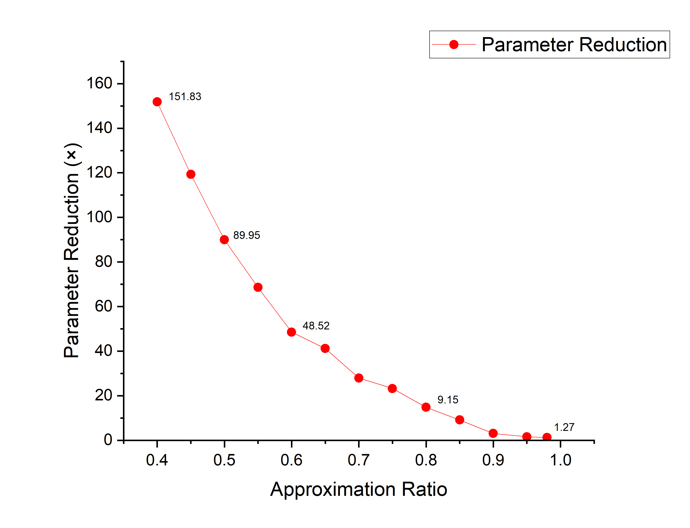

# Compress CNN With Tensor Decomposition

**A demo notebook ->**
<a target="_blank" href="https://colab.research.google.com/github/K0EKJE/CNN_compression_with_Tensor_Decomposition/blob/main/CNN_compression_demo.ipynb">
  
</a>

## Table of Contents
1. [Introduction](#introduction)
2. [Takeaways](#Takeaways)
3. [Prerequisites](#Prerequisites)
4. [Theory](#Theory)
5. [Implementation](#Implementation)
6. [Result](#Result)
7. [References](#References)

### Introduction
In this research project I developed a method to compress convolutional layers of a CNN model with Tensor Decomposition using [PyTorch](http://pytorch.org/) and [Tensorly](http://tensorly.org/). Intuitively, the proposed method substitutes each convolutional layer with three smaller layers with partial Tucker Decomposition, or CP decomposition. Singular value thresholding is utilized to select ranks for the partial Tucker Decomposition, where ranks control the trade-off between compression rate and model accuracy.

The training is completely conducted on google colab using NVIDIA Tesla T4.

### Theory
#### Tucker Decomposition

The purpose of Tucker Decomposition is to approximate a higher-order tensor as a product of a series of lower-dimensional factor matrices and a core tensor. It is based on the idea of mode-n product. Partial Tucker decomposition is an important variant of the Tucker decomposition. It decomposes a tensor into a core tensor multiplied by factor matrices along a subset of its modes.


The mechanism behind the compression of CNN using tensor methods is straightforward. Based on the definition,  a convolutional layer can be regarded as a linear mapping with a forth-order kernel. We can apply a partial Tucker decomposition to the kernel to get a core tensor and a series of factor matrices. Substituting the layer with new layers using the core tensor and factor matrices as kernels will define a sequence of linear mapping. This sequence of linear mapping will accomplish the same computation as before.


Decomposition rank is a key parameter. It governs the size of the tensor core after decompisition. In this implementation, approximation ratio, the ratio between Frobenius norms of the tensor recovered from factor matrices and core, and the original tensor, is introduced as an addition parameter for the choice of decomposition rank.

### Takeaways
- The decomposition can almost perfectly recover the ability of original model with proper CP decomposition rank, but it requires far more run time memory and time than Tucker Decomposition
- Introduction of the approximation ratio as a new hyper-parameter, which is found to be closely connected to the accuracy of the model;
- Proposal of a new scalable rank selection scheme for partial Tucker decomposition based on SVT to enable greater network compression;  
- The whole process including the training of original model, the Tucker decomposition of kernel tensors and fine-tuning can be directly implemented with PyTorch and Tensorly;
- Evaluated on VGG19, the method shows promising reduction in parameter size at the cost of trivial accuracy loss; and at the same level of compression, the proposed method shows a higher accuracy as compared with the one-shot decomposition method using VBMF.
- The accuracy of decomposed model recovers fast after one epoch of fine tuning.


### Prerequisites
- Python
- PyTorch 2.1.0+cu118
- Tensorly 0.8.1

### Implementation

#### Training
If you don't wish to use the pretrained model weights, start a new training with
```
python main.py --train
```
and manually resume the training with
```
python main.py --resume
```
I trained on VGG19 for around 250 epochs. The default training params are set in ```config.py``` as follow
```
learning_rate = 0.01
momentum = 0.9
```
A file called ```ckpt.pth``` will be created under a folder named ```./checkpoint/ckpt.pth``` during training. It will be a dictionary with a record of the weight data, step time, total time, loss, and accuracy for both testing and training set. Set ```new_weight_path``` variable in the config file to be ```""``` in order to use the new weights.

Then determine the layers for decomposition by altering ```layer_to_decomp``` and ```rank``` in ```config.py```. They are defined by lists, where ```layer_to_decomp = [3,7], rank = [32,64]``` corresponds to perform rank 32 decomposition on the 3rd layer and rank 64 decomposition on the 7th layer. Be sure to check whether the layer is a convolutional layer by checking the model structure.

#### Decomposing
Start decomposition with
```
python main.py --decompose
```
It will save the decomposed model as ```"decomposed_model"``` and output current accuracy of the model.

Decompose more layers with ```--add```
```
python main.py --decompose --add
```
- Note: set ```layer_to_decomp``` and ```rank``` to new layers.

#### Testing and fine-tuning
Lastly ```--run_model``` will automatically load the model named ```"decomposed_model"```, but it can be adjusted by the ```model_path``` variable in ```config.py```. It will output the current accuracy of the decomposed model(same as above).
```
python main.py --run_model
```
Then use ```--fine_tune``` and ```--lr``` to fine tune the decomposed model.
```
python main.py --run_model --fine_tune --lr = 0.00001
```
Set ```fine_tune_epochs``` in ```config.py``` to control total epochs for fine tuning.

---

### Result
| Decomposition             | Approximation Ratio | Compression    |Acc(No FT)|Acc(FT) | Param Size(M) |
| ----------------- | ------------     | ------- |-------   |--------| ----------|
|  Layer2       | 0.4              | x45.53   |17.21%    |90.32%      |0.13|
|  Layer2       | 0.6               |x23.93     |57.96%    |91.92%  |0.41|
|  Layer2       | 0.8               |x9.62      |88.35%    |92.55%  |1.35|
|  Layer2       | 0.9               |x3.97       |92.03%    |92.99%  |6.49|
|  Layer2       | 0.98              |x1.21      |93.15%    |93.15%  |15.74|


<style>
  .img {
    display: inline-block;
  }
  img.mobile-image {
	width: 49%;
    display: inline-block;
  }
</style>

Decomposing Layer 2 only

---

| Decomposition             | Approximation Ratio | Compression    |Acc(No FT)|Acc(FT) | Param Size(M) |
| ----------------- | ------------     | ------- |-------   |--------| ----------|
| Whole Net             | 0.4              | x151.83   |10.00%    |63.20%      |0.13|
| Whole Net               | 0.6               |x41.17     |17.82%    |87.88%  |0.41|
| Whole Net               | 0.8               |x14.80       |84.12%    |91.91%  |1.35|
| Whole Net               | 0.9               |x3.09       |91.13%    |92.41%  |6.49|
| Whole Net               | 0.98              |x1.27      |92.85%    |92.91%  |15.74|




<style>
  .img {
    display: inline-block;
  }
  img.mobile-image {
	width: 49%;
    display: inline-block;
  }
</style>

Whole Network compression

---

### Some References

[1] https://github.com/kuangliu/pytorch-cifar

[2] https://github.com/jacobgil/pytorch-tensor-decompositions

[3] [Very Deep Convolutional Networks for Large-Scale Image Recognition](https://arxiv.org/abs/1409.1556)

[4] [Speeding-up Convolutional Neural Networks Using Fine-tuned CP-Decomposition](https://arxiv.org/abs/1412.6553)

[5] [Compression of Deep Convolutional Neural Networks for Fast and Low Power Mobile Applications](https://arxiv.org/abs/1511.06530)

[6] [Tensorizing Neural Networks](https://arxiv.org/abs/1509.06569)

[7] [Tensor-Train Decomposition](https://epubs.siam.org/doi/10.1137/090752286)

[8] [Tensor Decompositions and Applications](http://www.kolda.net/publication/TensorReview.pdf)
